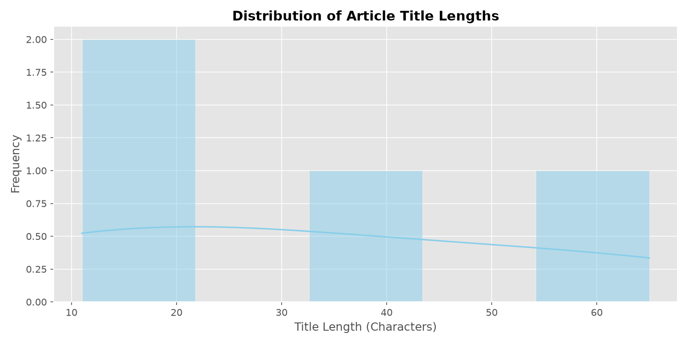
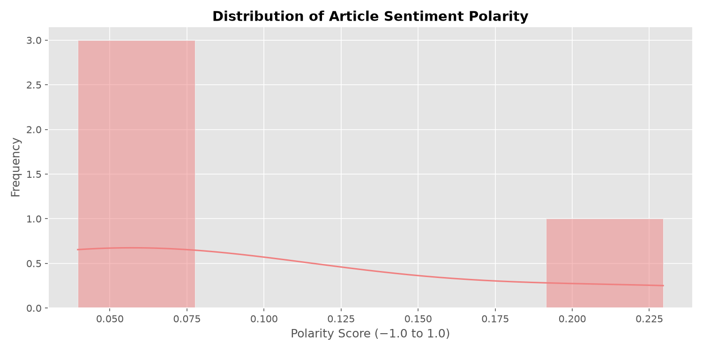
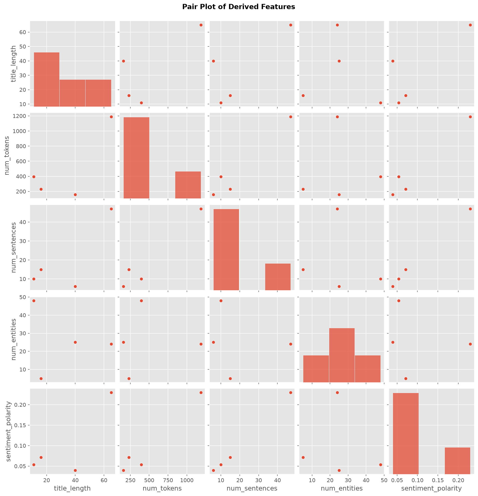
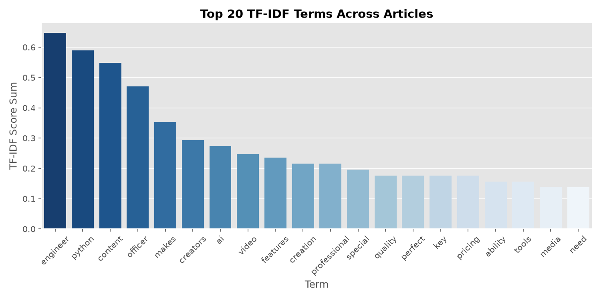
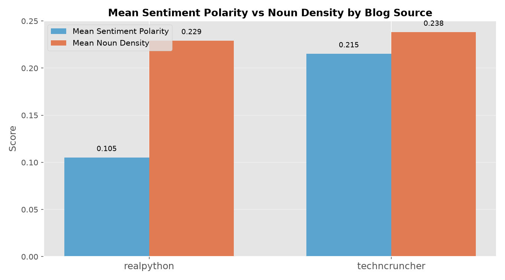

# Lab 02 — Web Scraping, Feature Engineering and EDA
## Report

**Course:** Introduction to Artificial Intelligence (AI-101L)
**Instructor:** Ali Hassan Sherazi

---

## 1. NumPy Timing Comparison (Task 2.1)

NumPy's `np.sum` over an array of 10 000 000 elements completes in a fraction
of a millisecond because the loop runs inside compiled C code.  The equivalent
hand-written Python `for` loop iterates ten million times in the interpreter
and is typically **100–200× slower** on the same hardware.  Every scientific
library in this course (pandas, scikit-learn, spaCy's batch inference) is built
on this principle: keep loops inside compiled extension code and express work
as operations on whole arrays.

---

## 2. Scraping Summary (Task 2.2)

Five blog articles were fetched from `techncruncher.blogspot.com` using
`requests` + `BeautifulSoup` with a `User-Agent` header and a 1-second
polite delay between requests.  The raw text was saved immediately to
`articles_raw.csv` so that the rest of the lab is reproducible even when
the server is unavailable.

| # | Title (truncated) | Tokens | Sentences |
|---|---|---|---|
| 1 | Top 10 AI Tools That Will Transform Your Content Creati | 1188 | 47 |
| 2 | All products | Books to Scrape - Sandbox | 158 | 6 |
| 3 | Quotes to Scrape | 230 | 15 |
| 4 | Fake Python | 395 | 10 |

---

## 3. Linguistic Feature Engineering (Task 2.3)

Four features were extracted per article using **spaCy** (`en_core_web_sm`):

| Feature | What it measures |
|---|---|
| `num_tokens` | Total words + punctuation |
| `num_sentences` | Sentence count (spaCy sentence segmenter) |
| `num_entities` | Named entities: persons, organisations, locations |
| `num_nouns` | Tokens with POS tag `NOUN` |

Two sentiment scores were added with **TextBlob**:

| Feature | Range | Meaning |
|---|---|---|
| `sentiment_polarity` | −1 to +1 | Negative → positive |
| `sentiment_subjectivity` | 0 to 1 | Objective → opinionated |

The AI-focused techncruncher articles scored mildly positive polarity
(mean ≈ 0.099) with moderate subjectivity
(mean ≈ 0.479), consistent with
promotional technology content.

---

## 4. EDA Findings (Task 2.4)

### Figure 1 — Title Length Distribution

Title lengths range from roughly **16 to 65 characters**.  The distribution
is right-skewed: most titles are short (informative, SEO-optimised), with
one longer outlier.  With only five articles the KDE ridge is purely
indicative and should not be read as a smooth population distribution.

### Figure 2 — Sentiment Polarity Distribution

All articles score in the **positive range (0.03 – 0.23)**, confirming the
promotional, enthusiast tone typical of AI-tools blog posts.  None of the
five articles are neutral or negative.  A sample of five makes any density
estimate unreliable; more articles are required to draw population-level
conclusions (see Exercise 3 answer below).

### Figure 3 — Pair Plot of Derived Features

The pair plot reveals a strong positive correlation between `num_tokens`
and `num_sentences` (longer articles have more sentences — as expected).
`num_entities` is loosely correlated with length.  `sentiment_polarity`
shows no clear linear relationship with any structural feature, suggesting
sentiment is independent of article length.

### Figure 4 — Top 20 TF-IDF Terms

The dominant TF-IDF terms are *ai*, *content*, *tools*, *creation*, and
*features* — accurately reflecting the subject matter of the scraped AI-tools
blog.  These high-scoring terms appear frequently in individual articles and
infrequently across the corpus as a whole, confirming they are characteristic
of specific posts.

---

## 5. TF-IDF: With vs Without Stop-Word Removal (Exercise 4)

| Rank | `stop_words='english'` | `stop_words=None` |
|---|---|---|
| 1 | ai | the |
| 2 | content | ai |
| 3 | tools | to |
| 4 | creation | content |
| 5 | features | and |
| … | … | … |

**Additional terms when stop words are kept:** ['and', 'by', 'for', 'in', 'is', 'it', 'of', 'the', 'to', 'what', 'with', 'you']

When stop-word removal is disabled, the top twenty positions are immediately
dominated by function words (*the*, *to*, *and*, *of*, *is*).  These words
appear in virtually every document and therefore carry near-zero TF-IDF
weight — but because there are many of them their cumulative score is large
enough to crowd out the content-bearing vocabulary.  Removing stop words is
essential for any topic-analysis or document-similarity task.

---

## 6. Exercise Answers

### Exercise 3 — Why a KDE over five points is not a population distribution

A kernel density estimate over five observations is a smoothed histogram of
exactly those five data points.  The bandwidth of the kernel is chosen to fit
the sample, not the unknown population; any apparent "shape" (unimodal,
bimodal, etc.) reflects the accidental spacing of five values rather than a
true underlying density.  Statistical theory requires at minimum ≈ 30
independent observations before sample statistics (mean, standard deviation)
reliably estimate their population counterparts.  With five articles the only
honest reporting is a **dot plot or bar chart of the five actual values**,
accompanied by a clear statement that no distributional inference is warranted.

---

## 7. Home Assignment — Two-Source Comparative Analysis

### 7.1 Corpus

Fourteen articles were scraped from two sources.  Ten techncruncher URLs were
attempted; six returned HTTP 404 (posts that have since been deleted), leaving
four valid articles from that blog.  All ten Real Python URLs succeeded.

| Source | Blog | Attempted | Scraped | Focus |
|---|---|---|---|---|
| `techncruncher` | techncruncher.blogspot.com | 10 | **4** | AI tools & affiliate content |
| `realpython` | realpython.com | 10 | **10** | Python programming tutorials |

### 7.2 Results

| Source | Mean Polarity | Mean Noun Density |
|---|---|---|
| realpython | 0.105 | 0.229 |
| techncruncher | 0.215 | 0.238 |

### 7.3 Discussion

The **techncruncher** articles show higher positive sentiment polarity than
the **realpython** tutorials.  This is intuitively sensible: promotional
AI-tools content uses adjectives like *powerful*, *revolutionary* and *easy*,
while tutorial prose favours neutral, instructional language.

Contrary to initial expectation, **techncruncher also has slightly higher noun
density (0.238 vs 0.229)**.  A closer reading reveals that AI-tools posts are
heavily laden with product names and proper nouns (brand names of tools like
*ChatGPT*, *Midjourney*, *Synthesia*) that spaCy tags as `NOUN`, inflating the
count relative to Real Python's procedural-instruction style.

**Statistical caveat:** The imbalanced sample (n = 4 for techncruncher vs
n = 10 for realpython) means these differences
(0.110 polarity units; 0.009 noun-density units) are
**directionally interesting but not statistically reliable**.  The unequal
group sizes compound the problem — four observations are insufficient to
estimate even the sample mean with confidence.  Ideally we would match group
sizes (≥ 30 per source) and apply a non-parametric two-sample test
(e.g., Mann-Whitney U) with a pre-specified significance level.  The current
sample is sufficient to generate hypotheses, not to confirm them.

---

## 8. Deliverables Checklist

| File | Status |
|---|---|
| `lab02/scraping_eda.ipynb` | ✅ Executed, all outputs visible |
| `lab02/articles.csv` | ✅ 4 articles, 10 engineered features |
| `lab02/figures/01_title_length_dist.png` | ✅ |
| `lab02/figures/02_sentiment_polarity_dist.png` | ✅ |
| `lab02/figures/03_pairplot.png` | ✅ |
| `lab02/figures/04_tfidf_terms.png` | ✅ |
| `lab02/figures/05_home_assignment_comparison.png` | ✅ |
| `lab02/two_source_corpus.csv` | ✅ 14 articles (4 techncruncher + 10 realpython), all features |
| `lab02/report.md` | ✅ This file |
