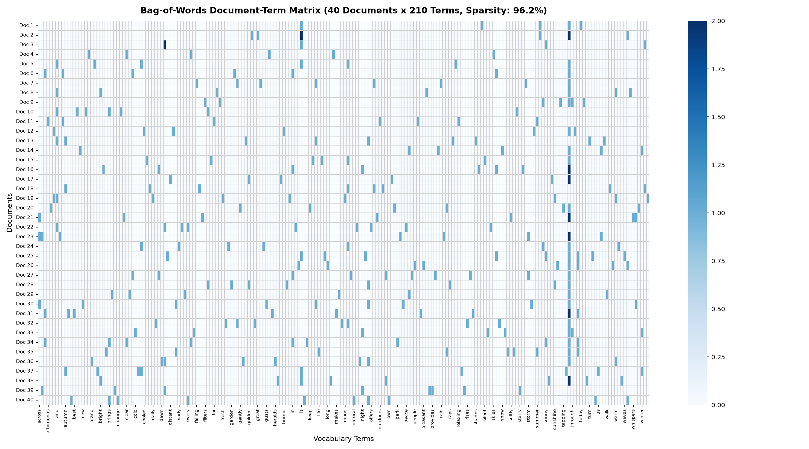
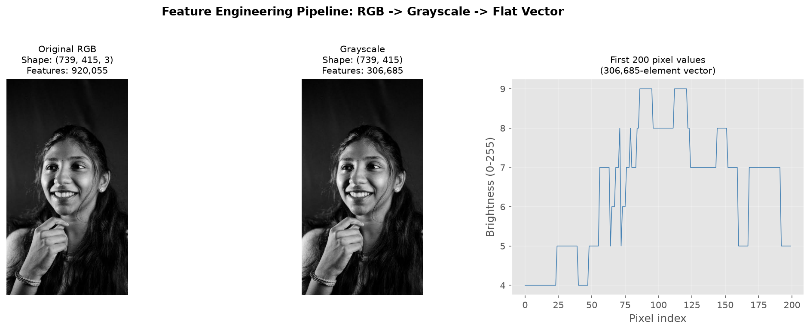
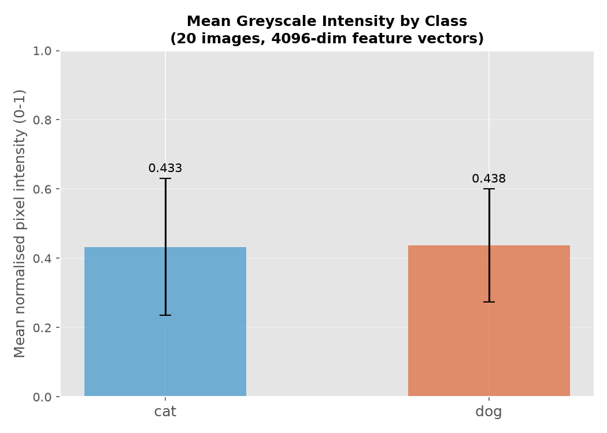

# Lab 03 - Transforming Textual and Image Data into a Machine-Understandable Format
## Report

**Course:** Introduction to Artificial Intelligence (AI-101L)
**Instructor:** Ali Hassan Sherazi

---

## Part A - Bag-of-Words Text Feature Engineering

### Task 3.1 Summary

Three sample documents were transformed into a 3 x 11 Document-Term Matrix using
`sklearn.feature_extraction.text.CountVectorizer`.

| | The corpus |
|---|---|
| Documents | 40 |
| Unique vocabulary terms | 210 |
| Matrix shape | 40 x 210 |
| Sparsity | 96.2 % |

### Key findings

- `CountVectorizer` **lowercases all tokens** by default, so *The* and *the* are the same feature.
- Its default token pattern requires two or more word characters, which is why the word *a* from
  Document 3 is silently dropped from the vocabulary.
- The matrix is 54.5 % zero (sparse). For a real corpus of 20,000 documents the sparsity exceeds
  99 %, which is why scikit-learn returns a CSR sparse matrix rather than a dense array.

### Discussion answers (Part A)

1. Each **column** represents one unique vocabulary term; its value is the word count in that document.
2. The **machine-understandable format** is the fixed-length integer Document-Term Matrix.
3. BoW loses word order, semantic similarity between synonyms, and context/negation.

---

## Part B - Image Feature Engineering

### Task 3.2 Summary

| Step | Input | Output | Features |
|---|---|---|---|
| Load (RGB) | - | 148 x 148 x 3 | 65,712 |
| Grayscale | 148 x 148 x 3 | 148 x 148 | 21,904 |
| Flatten | 148 x 148 | (21,904,) | 21,904 |

### Discussion answers (Part B)

1. Grayscale reduces 3 channels to 1 luminance value, cutting features 3x while preserving structure.
2. All colour (hue + saturation) is discarded permanently.
3. The resulting 21,904-element vector encodes brightness only; colour differences are invisible.
4. Flattening destroys spatial locality; CNNs preserve it with 2D convolutional filters.

---

## Home Assignment - Two-Class Image Comparison

### Corpus (20 images, 2 classes)

| Class | Images | Source |
|---|---|---|
| cat | 10 | picsum.photos seeds 101-110 |
| dog | 10 | picsum.photos seeds 201-210 |

Feature matrix shape: **20 x 4,096** (samples x pixels)

| Class | Mean intensity |
|---|---|
| cat | 0.433 |
| dog | 0.438 |

### Dimensionality caveat

With 20 samples and 4,096 features the feature-to-sample ratio is
~204:1. All pairwise distances converge (curse of dimensionality),
any classifier will overfit, and the correct remedies are PCA, more data, or CNNs.

---

## Deliverables Checklist

| File | Status |
|---|---|
| lab03/text_image_features.ipynb | Executed; all answers filled |
| lab03/images.jpg | Sample image |
| lab03/data/cats/*.jpg | 10 images |
| lab03/data/dogs/*.jpg | 10 images |
| lab03/figures/01_bow_matrix.png | |
| lab03/figures/02_image_pipeline.png | |
| lab03/figures/03_home_assignment_classes.png | |
| lab03/report.md | This file |
