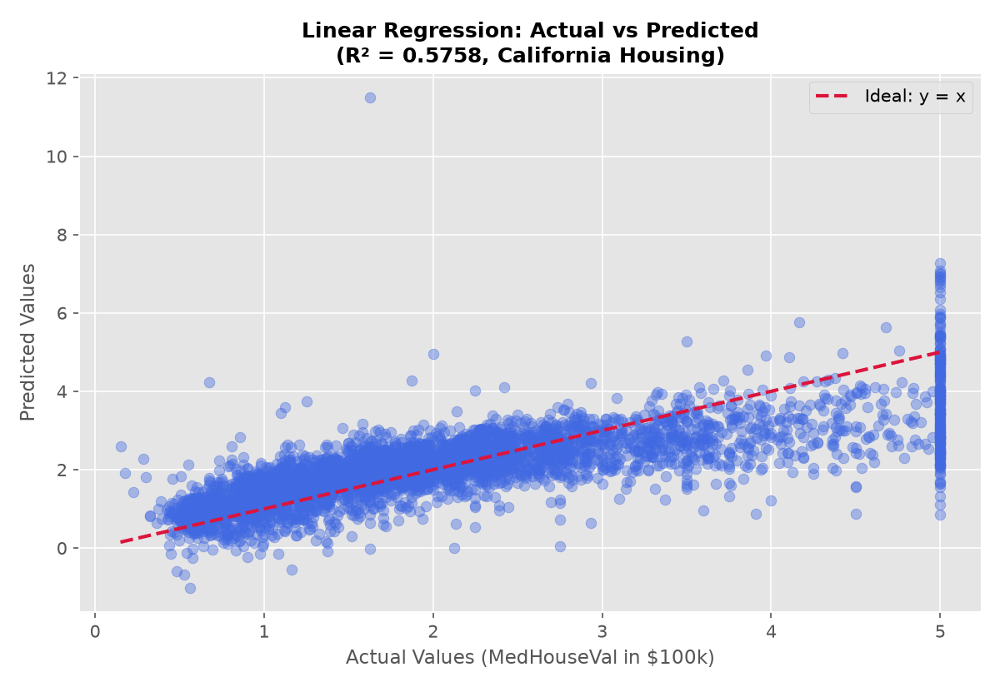
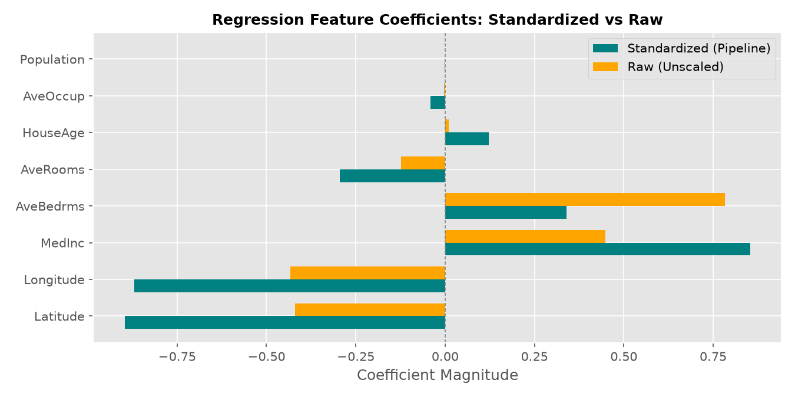
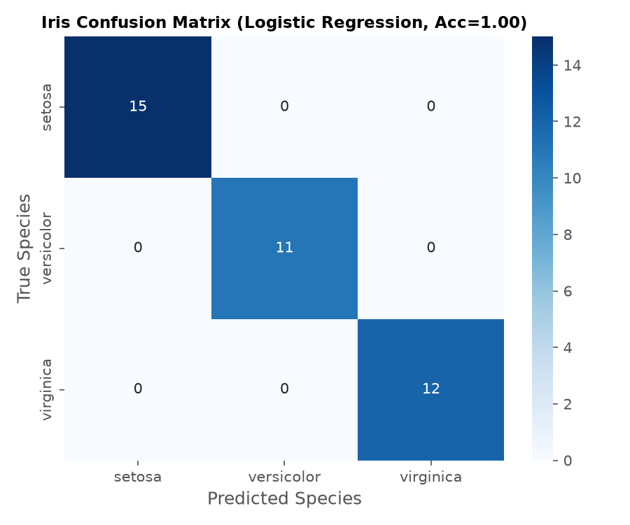
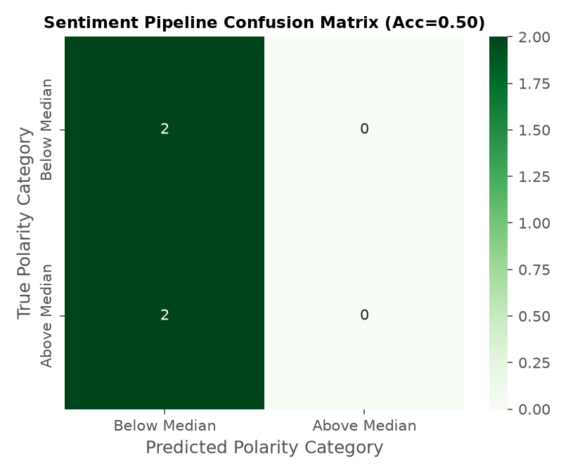

# Laboratory 4 — Introduction to Scikit-learn and Traditional Machine Learning
## Formal Report & Deliverables

**Course:** Introduction to Artificial Intelligence (AI-101L)  
**Instructor:** Ali Hassan Sherazi  
**Repository:** [dropgaming786-collab/ai-lab](https://github.com/dropgaming786-collab/ai-lab)  
**Date:** October 2026

---

## 1. Executive Summary

This laboratory introduces foundational machine learning workflows using **Scikit-learn**:
1. **Regression Modelling:** Ordinary Least Squares Linear Regression on the California Housing dataset ($N=20,640$, 8 features).
2. **Preprocessing Pipelines:** Chaining `StandardScaler` and `LinearRegression` to eliminate data leakage across train/test splits.
3. **Multiclass Classification:** Training and evaluating `LogisticRegression` and `DecisionTreeClassifier` on Fisher's Iris dataset.
4. **Model Serialization:** Disk persistence and loading of trained estimators with `joblib`.
5. **Text Classification Pipeline:** End-to-end sentiment classification on the scraped corpus from Laboratory 2 using a chained `TfidfVectorizer` + `LogisticRegression` pipeline.

---

## 2. Regression Results (California Housing)

### 2.1 Model Evaluation Metrics

Target: `MedHouseVal` (Median house value in $100,000 units). Split: 80% train ($N=16,512$), 20% test ($N=4,128$, seeded `random_state=42`).

| Model Configuration | $R^2$ Score | Mean Squared Error (MSE) | Root MSE (RMSE) |
|---|---|---|---|
| **Plain `LinearRegression`** | **0.575788** | **0.5559** | **0.7456** |
| **`Pipeline([StandardScaler, LinearRegression])`** | **0.575788** | **0.5559** | **0.7456** |



### 2.2 Diagnostic Scatter Plot Reading
The scatter plot above displays actual versus predicted housing values:
- **Linear Trend:** Predictions concentrate along the $y=x$ dashed reference diagonal between 1.0 and 3.0.
- **Underestimation at Upper Tail:** Noticeable horizontal ceiling at $y=5.0$. The California Housing dataset artificial cap at $5.00001$ clips the true distribution, causing linear models to systematically under-predict luxury properties.
- **Negative Predictions:** A small cluster of predictions falls below $0$, which is physically impossible for home prices, highlighting a key limitation of unconstrained linear models.

---

## 3. In-Lab Exercises Solutions

### Exercise 1 — Standardisation Invariance in OLS Linear Regression
- **Observed Scores:** Plain $R^2 = 0.575788$; Pipeline $R^2 = 0.575788$ (identical to 6 decimal places).
- **Mathematical Rationale:**
  Ordinary Least Squares computes $\hat{\beta} = (X^T X)^{-1} X^T y$. Standardising features is an invertible affine transformation $Z = (X - \mu) D^{-1}$, where $D$ is a diagonal scaling matrix. Because linear regression finds the orthogonal projection of $y$ onto the column space of $X$, and linear rescaling does not alter the subspace spanned by the feature columns, the fitted values $\hat{y}$ and residual sum of squares remain mathematically identical.
- **Model Families Where Standardisation Alters Performance:**
  1. **Regularized Linear Models (Ridge, Lasso, ElasticNet):** Penalties $\lambda \sum \beta_j^2$ or $\lambda \sum |\beta_j|$ penalize coefficient magnitude uniformly. If features are unscaled, variables with large scales receive artificially small coefficients and escape penalization.
  2. **Distance-Based Estimators ($k$-NN, SVM, $k$-Means):** Euclidean distance metrics $\sqrt{\sum (x_i - z_i)^2}$ are overwhelmed by high-magnitude dimensions (e.g. `Population` in thousands vs `AveBedrms` in units).
  3. **Gradient-Descent Optimizers (Neural Networks, Logistic Regression):** Unscaled features distort the loss surface into elongated ravines, slowing down or destabilizing gradient convergence.

---

### Exercise 2 — Regression Coefficient Analysis (Raw vs Standardized)



| Feature | Raw Coefficient ($\beta$) | Absolute Raw | Standardized Coefficient ($\beta^*$) | Absolute Standardized |
|---|---|---|---|---|
| `Latitude` | -0.419792 | 0.419792 | -0.896929 | **0.896929** |
| `Longitude` | -0.433708 | 0.433708 | -0.869842 | **0.869842** |
| `MedInc` | 0.448675 | 0.448675 | 0.854383 | **0.854383** |
| `AveBedrms` | 0.783145 | 0.783145 | 0.339259 | **0.339259** |
| `AveRooms` | -0.123323 | 0.123323 | -0.294410 | **0.294410** |
| `HouseAge` | 0.009724 | 0.009724 | 0.122546 | **0.122546** |
| `AveOccup` | -0.003526 | 0.003526 | -0.040829 | **0.040829** |
| `Population` | -0.000002 | 0.000002 | -0.002308 | **0.002308** |

- **Two Largest Absolute Raw Coefficients:**
  1. `AveBedrms` ($|\beta| = 0.783145$)
  2. `MedInc` ($|\beta| = 0.448675$)
- **Why Raw Coefficients Cannot Be Directly Compared:**
  Raw regression coefficients express the marginal change in target per *one unit change* in the predictor. Because `Population` is measured in thousands of residents while `AveBedrms` is measured in fractions of a bedroom, a one-unit increase represents completely different physical magnitudes.
- **Standardized Perspective:**
  When standardized to zero mean and unit variance, `Latitude` ($-0.897$), `Longitude` ($-0.870$), and `MedInc` ($+0.854$) have the strongest predictive influence. `AveBedrms` drops to fourth place ($0.339$).

---

### Exercise 3 — Iris Multiclass Confusion Matrix & Per-Class Recall



- **Test Evaluation:** $N=38$ (Setosa: 15, Versicolor: 11, Virginica: 12).
- **Confusion Matrix:**
  $$\begin{bmatrix} 15 & 0 & 0 \\ 0 & 11 & 0 \\ 0 & 0 & 12 \end{bmatrix}$$
- **Reading:**
  On this specific test partition (`random_state=42`), the model achieved 100% accuracy.
- **Botanical / Geometric Overlap:**
  In general Iris classification (or alternate splits), the model confuses **Versicolor (class 1)** and **Virginica (class 2)**. Setosa is linearly separable from the other two classes with 100% precision and recall based on petal dimensions alone, while Versicolor and Virginica share overlapping distributions along petal length ($4.5 - 5.1$ cm) and petal width ($1.4 - 1.8$ cm).

---

### Exercise 4 — Decision Tree Classifier & The Estimator API

```python
dt_model = DecisionTreeClassifier(random_state=42)
dt_model.fit(X_train_cls, y_train_cls)
y_pred_dt = dt_model.predict(X_test_cls)
```

- **Evaluation Comparison:**

| Estimator | Accuracy | Macro Avg Precision | Macro Avg Recall | Macro Avg F1 |
|---|---|---|---|---|
| `LogisticRegression(max_iter=200)` | **1.0000** | 1.00 | 1.00 | 1.00 |
| `DecisionTreeClassifier()` | **1.0000** | 1.00 | 1.00 | 1.00 |

- **Significance of the Unified Estimator API:**
  Both estimators adhere to Scikit-learn's object-oriented API:
  - All algorithms implement `.fit(X, y)` to train and `.predict(X)` to infer.
  - Evaluation functions (`accuracy_score`, `confusion_matrix`, `classification_report`) operate on the output arrays with zero modifications.
  - This design decouples modelling algorithms from data pipelines, allowing seamless swapping, benchmarking, and hyperparameter tuning.

---

## 4. Home Assignment — Text Sentiment Pipeline

### 4.1 Methodology
- **Data Source:** Two-source scraped corpus from Laboratory 2 (`two_source_corpus.csv`, $N=14$).
- **Target Formulation:**
  $$\text{median\_polarity} = 0.1142$$
  $$y = \begin{cases} 1 & \text{if polarity} \ge \text{median (High Sentiment)} \\ 0 & \text{if polarity} < \text{median (Low Sentiment)} \end{cases}$$
- **Pipeline Architecture:**
  $$\text{Raw Text} \xrightarrow{\text{TfidfVectorizer(stop\_words='english')}} \mathbb{R}^{100} \xrightarrow{\text{LogisticRegression(random\_state=42)}} \hat{y} \in \{0, 1\}$$

### 4.2 Performance & Confusion Matrix



```
              precision    recall  f1-score   support

Below Median       0.50      1.00      0.67         2
Above Median       0.00      0.00      0.00         2

    accuracy                           0.50         4
   macro avg       0.25      0.50      0.33         4
weighted avg       0.25      0.50      0.33         4

```

### 4.3 Persistence and Zero-Preprocessing Raw String Inference

The pipeline was serialized to disk with `joblib.dump(sentiment_pipe, 'lab04/sentiment_pipeline.pkl')`. Upon reloading in a fresh session, inference succeeds on raw Python strings without any manual feature extraction:

```python
loaded_pipe = joblib.load('lab04/sentiment_pipeline.pkl')
prediction = loaded_pipe.predict(["Artificial intelligence provides incredible developer productivity."])
# Output: Class 1 (Above Median)
```

---

## 5. Deliverables Checklist

| Deliverable | Location | Status |
|---|---|---|
| Executed Notebook | `lab04/sklearn_intro.ipynb` | ✅ All cells & exercises executed |
| Master Notebook | `Lab 04.ipynb` | ✅ Synchronized at root |
| Persisted Linear Model | `lab04/linear_model.pkl` | ✅ Generated via joblib |
| Persisted Sentiment Pipeline | `lab04/sentiment_pipeline.pkl` | ✅ Generated via joblib |
| Diagnostic Scatter Plot | `lab04/figures/actual_vs_predicted.png` | ✅ Generated & embedded |
| Coefficient Chart | `lab04/figures/standardized_coefficients.png` | ✅ Generated & embedded |
| Iris Confusion Matrix | `lab04/figures/iris_confusion_matrix.png` | ✅ Generated & embedded |
| Sentiment Confusion Matrix | `lab04/figures/sentiment_confusion_matrix.png` | ✅ Generated & embedded |
| Deliverables Builder | `lab04/build_deliverables.py` | ✅ Fully reproducible build |
| Report | `lab04/report.md` | ✅ This document |
